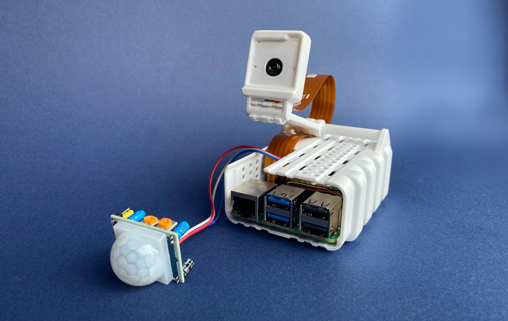

# AI Security Camera



An edge-to-cloud security-camera prototype that reduces unnecessary uploads: a Raspberry Pi captures motion, runs local person and face analysis, and sends only policy-selected events to a cloud API for persistence and optional LLM review. It is a portfolio prototype, not a production-ready security product.

## Why it matters

Security cameras produce far more routine motion than useful signals. This project keeps the first decision at the edge: recognized people and inconclusive motion stay local, while unknown people and prolonged presence can be uploaded for review. It demonstrates hardware integration, computer vision, API design, asynchronous work, and privacy/cost-aware event routing.

## Architecture

```text
PIR sensor + Pi camera
          |
          v
Raspberry Pi: capture -> YOLO person detection -> face/dwelling analysis
          |                                          |
          |                         event policy: only selected events upload
          v                                          v
FastAPI API -> MySQL + S3 media -> Redis/Celery -> optional OpenAI analysis
                                                  |
                                                  v
                                            alert record/log entry
```

The local Docker stack supplies FastAPI, a Celery worker, MySQL, and Redis. S3 storage is used by the cloud event endpoint; an OpenAI key enables asynchronous structured analysis. The mobile UI and real push delivery are planned work: the current notification task records/logs an alert result but does not send APNs, FCM, email, or SMS.

## Supported prototype flow

1. A PIR-triggered Pi capture is analyzed with YOLO, local face recognition, and dwelling analysis.
2. Unknown people upload; unknown dwelling is marked high priority. Known-person dwelling uploads only after 60 seconds; brief known-person and inconclusive events remain local.
3. The cloud API authenticates the device, stores event metadata and media references, and queues analysis when Redis/Celery is available.
4. With `OPENAI_API_KEY` configured, the worker requests structured analysis and records whether an alert is needed.
5. Authenticated users can retrieve their devices' events and short-lived media URLs through the REST API.

Hardware capture, cloud storage credentials, and OpenAI analysis are external dependencies, so this repository does not claim a verified end-to-end deployed environment.

## Quick start: cloud stack

Prerequisites: Docker Desktop with Compose, Python 3.11+ (for tests), and AWS credentials plus an S3 bucket if you upload real events. Copy the example before changing any secrets.

```bash
cp cloud/.env.example cloud/.env
docker compose --env-file cloud/.env -f cloud/docker-compose.yml up --build
```

In another terminal, confirm the API is running:

```bash
curl http://localhost:8000/health
```

Create the local schema and a user/device credential inside the API container:

```bash
docker compose --env-file cloud/.env -f cloud/docker-compose.yml exec api python -m cloud.manage init-db
docker compose --env-file cloud/.env -f cloud/docker-compose.yml exec api python -m cloud.manage create-user demo demo@example.com
docker compose --env-file cloud/.env -f cloud/docker-compose.yml exec api python -m cloud.manage create-device 1 front-door --device-id pi_device_001
```

Save the device API key printed by the final command. It is stored hashed and cannot be recovered. See [cloud/README.md](cloud/README.md) for API and environment details. Stop local services with `docker compose --env-file cloud/.env -f cloud/docker-compose.yml down` (add `--volumes` only when you intentionally want to discard local database data).

## Raspberry Pi prototype

Required hardware: Raspberry Pi supported by Picamera2, a compatible camera, a PIR sensor wired for the configured GPIO pin, network access, and adequate power/storage. Face recognition and YOLO dependencies can be resource-intensive on a Pi.

From the repository root, use the setup script on the Pi, configure the generated device credential, then run the module:

```bash
./pi/setup_pi.sh
./setup-pi.sh
python3 -m pi.setup_cloud --test
python3 -m pi.main
```

`setup-pi.sh` writes private connection settings to `pi/.env`; do not commit it. The edge code reads `CLOUD_API_URL`, `DEVICE_ID`, `DEVICE_API_KEY`, and optional `YOLO_MODEL` from that file.

## Verification

The automated suite covers pure event-routing behavior and cloud-communication retry/file handling; it does not exercise physical camera or GPIO hardware.

```bash
python3 -m pip install -r cloud/requirements-dev.txt
python3 -m compileall -q cloud pi tests
ruff format --check cloud pi tests
ruff check cloud pi tests
python3 -m pytest -q tests
docker compose -f cloud/docker-compose.yml config --quiet
docker build --tag security-camera:local cloud
```

For device-specific smoke checks after hardware setup, run `python3 -m pi.test.test_system` on the Pi. Those checks require the device libraries and connected hardware.

## Project map

| Path | Responsibility |
| --- | --- |
| `pi/` | Edge capture, sensors, local vision, event policy, and cloud client |
| `cloud/` | FastAPI API, database models, Celery tasks, and container configuration |
| `tests/` | Host-runnable tests for edge policy, cloud retries, authentication, ingestion, and retrieval |
| `images/security-camera.jpg` | Prototype photo used above |
| [DEPLOYMENT.md](DEPLOYMENT.md) | Local runbook and prototype deployment boundaries |

## Status and next steps

Implemented: local event routing, device API-key checks, user JWT login, event retrieval, containerized local services, and optional LLM analysis. Planned: a mobile UI, real push providers, hardened secret management, observability, migration strategy, and a production deployment review.

For setup details, read [cloud/README.md](cloud/README.md) and [DEPLOYMENT.md](DEPLOYMENT.md).
